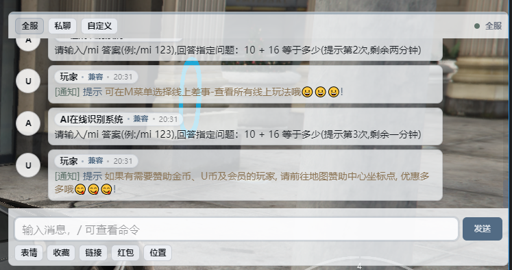
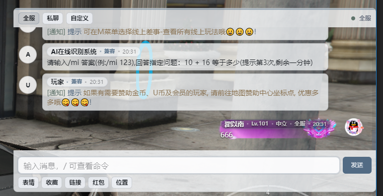
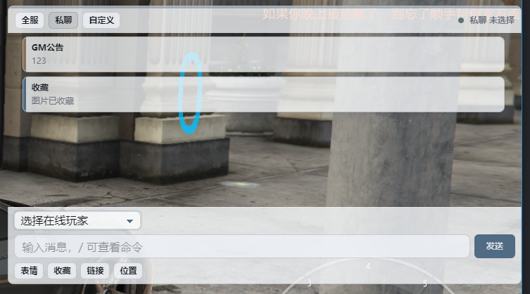
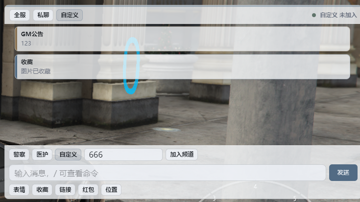
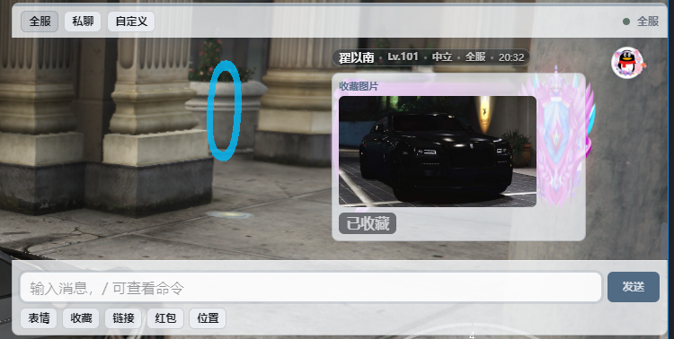
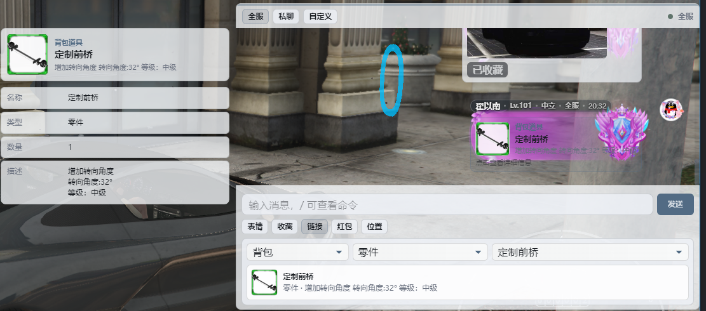
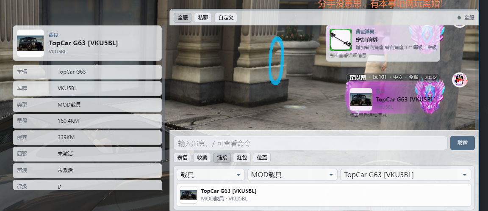
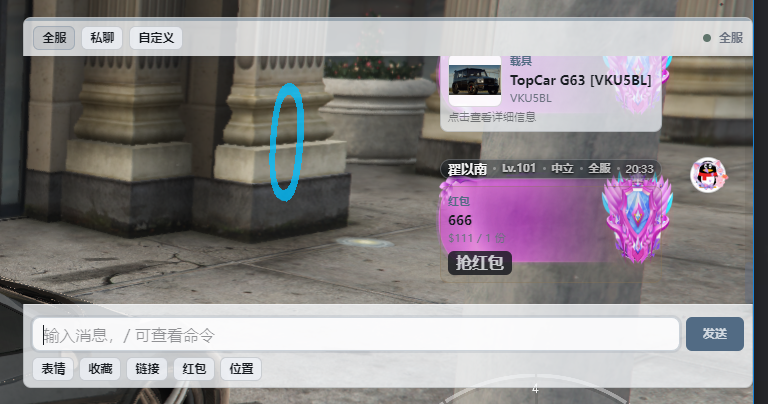
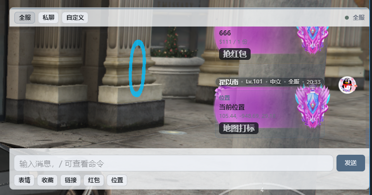

# ck_chat

[](https://github.com/ch-jack/ck_chat/actions/workflows/build.yml)

FiveM 富文本 NUI 聊天资源，支持 ESX / QBCore / ox_inventory / ck_realplate。

作者: JACK  
联系方式: QQ 2518926462



## 特性

- ESX / QBCore 自动识别，也可以在配置里强制指定。
- ox_inventory 背包兼容，支持显示物品 metadata。
- 车库车辆信息展示，支持 ESX `owned_vehicles` 和 QB `player_vehicles`。
- 支持 ck_realplate 的 `realplate / realplate2 / realplate3` 三个真实车牌槽位；有几个显示几个，没有真实车牌时只显示原车库车牌。
- 支持全服、私聊、自定义频道、职业预设频道。
- 支持文字、系统公告、GM 命令提示、道具链接、车辆链接、图片收藏、坐标分享、红包。
- 支持动态头像框和聊天框展示，可通过管理命令给玩家设置。
- GitHub Actions 自动校验并打包 `ck_chat.zip`。

## 依赖

必需:

- FiveM artifact 支持 `cerulean`
- `oxmysql`
- ESX 或 QBCore 至少一个

可选:

- `ox_inventory`: 背包物品和 metadata 展示优先使用它
- `ck_realplate`: 车辆链接显示真实车牌槽位

## 安装

1. 将资源目录放到服务器资源目录，例如:

```text
resources/[local]/ck_chat
```

2. 在 `server.cfg` 中保证依赖先启动:

```cfg
ensure oxmysql
ensure es_extended
# 或 ensure qb-core

# 可选
ensure ox_inventory
ensure ck_realplate

ensure ck_chat
```

3. 按你的服务器环境修改 `config.lua`。

4. 重启资源:

```cfg
restart ck_chat
```

## 配置

配置文件: `config.lua`

```lua
CKChatConfig.Framework = 'auto' -- auto / esx / qb
CKChatConfig.Inventory = 'auto' -- auto / ox / framework
CKChatConfig.MoneyAccount = 'cash'
CKChatConfig.CustomChannelJoinCost = 10000

CKChatConfig.Garage = {
    Framework = 'auto',
    OnlyStored = true,
    ESXTable = 'owned_vehicles',
    QBTable = 'player_vehicles',
}
```

说明:

- `Framework = 'auto'`: 自动优先识别 QBCore，其次 ESX。
- `Inventory = 'auto'`: `ox_inventory` 已启动时优先使用 OX，否则回退到框架背包。
- `MoneyAccount`: 红包、自定义频道扣钱/加钱账户。ESX 的 `cash` 会映射到 `money`。
- `CustomChannelJoinCost`: 加入手动自定义频道费用，填 `0` 表示免费；预设职业频道不扣费。
- `OnlyStored = true`: 只展示入库车辆。ESX 读取 `stored`，QB 读取 `state`。
- ck_realplate 真实车牌无需配置开关，始终读取 `realplate`、`realplate2`、`realplate3` 三个槽位。

## 功能用法

### 1. 全服聊天

默认按键: `T`

也可以执行客户端命令:

```text
openNewChat
```

全服频道是默认频道，所有在线玩家都能看到消息；支持普通文本、系统公告、GM 提示和 FiveM 颜色码。

```text
^3黄色文字 ^7恢复默认
```


### 2. 动态头像框和聊天框

管理员可以给玩家设置头像框和聊天框效果，聊天消息会展示玩家头像、等级、职业、频道和动态框样式。

命令:

```text
/ckchat_frame <玩家ID> <头像框ID>
/ckchat_boxframe <玩家ID> <聊天框ID>
```



### 3. 私聊

使用方法:

1. 点击顶部 `私聊`。
2. 在下拉框选择在线玩家。
3. 输入消息并发送。

私聊只发送给指定玩家，右上角会显示当前私聊选择状态。



### 4. 自定义频道

支持:

- 手动输入自定义频道名。
- 选择 `config.lua` 里的预设职业频道，例如警察、医护。

使用方法:

1. 点击顶部 `自定义`。
2. 选择预设频道或输入自定义频道名。
3. 点击 `加入频道`。
4. 发送消息。

费用:

- 手动输入的自定义频道按 `CKChatConfig.CustomChannelJoinCost` 扣费。
- 预设职业频道不扣费。
- `CKChatConfig.CustomChannelJoinCost = 0` 时自定义频道免费。



### 5. 收藏发送图片

使用方法:

1. 点击 `收藏`。
2. 输入图片 URL 并收藏。
3. 点击收藏图发送图片。

说明:

- 图片 URL 必须是 `http://` 或 `https://`。
- 收藏数据保存在玩家本地 NUI `localStorage`。



### 6. 发送物品链接和 OX metadata

使用方法:

1. 点击 `链接`。
2. 选择 `背包`。
3. 选择分类和物品。
4. 发送消息。

当 `ox_inventory` 启动时，物品会读取:

- `name`
- `label`
- `count`
- `slot`
- `weight`
- `metadata`

metadata 会显示为详情字段，例如:

```text
元数据:plate
元数据:description
元数据:durability
```



### 7. 发送载具链接和 ck_realplate 真实车牌

使用方法:

1. 点击 `链接`。
2. 选择 `载具`。
3. 选择车库分类和车辆。
4. 发送消息。

车辆来源:

- ESX: `owned_vehicles`
- QBCore: `player_vehicles`

ck_realplate 支持:

- `realplate`
- `realplate2`
- `realplate3`

显示规则:

- 数据库里有几个真实车牌槽位，就在车辆列表中显示几条。
- 如果三个真实车牌字段都没有值，只显示一条原车库车牌。
- 详情中保留 `原车库车牌`，方便排查。



### 8. 发红包

使用方法:

1. 点击 `红包`。
2. 输入金额和份数。
3. 发送。
4. 其他玩家点击红包卡片领取。

限制:

- 私聊频道不能发红包。
- 最大金额由 `server.lua` 内 `MAX_REDPACKET_AMOUNT` 控制，默认 `50000`。
- 扣款和加款账户由 `CKChatConfig.MoneyAccount` 控制。



### 9. 发位置

使用方法:

1. 点击 `位置`。
2. 当前输入框内容会作为位置标题。
3. 发送后其他玩家点击 `地图打标`。

说明:

- 服务端保存坐标 30 分钟。
- 客户端会调用 `SetNewWaypoint` 并创建路线 blip。



### 10. 管理命令

命令:

```text
/gm <内容>
/ckchat_system <内容>
/ckchat_mute <玩家ID> <分钟>
/ckchat_unmute <玩家ID>
/ckchat_muteall
/ckchat_frame <玩家ID> <头像框ID>
/ckchat_boxframe <玩家ID> <聊天框ID>
```

权限:

- 框架 group 在 `CKChatConfig.AdminGroups` 中配置。
- 同时支持 ACE `group.<name>` 和 `command.ckchat_admin`。


## 导出

服务端导出:

```lua
exports['ck_chat']:SendSystemMessage('公告内容', '标题', 'info')
```

```lua
exports['ck_chat']:SendCustomLink(source, {
    channel = 'global',
    mode = 'link',
    linkType = 'custom',
    title = '标题',
    subtitle = '副标题',
    payload = {},
    details = {
        { key = 'id', label = 'ID', value = '1001' }
    },
    meta = {}
})
```

## 自动化构建

本地打包:

```powershell
powershell -NoProfile -ExecutionPolicy Bypass -File scripts/build.ps1
```

输出:

```text
dist/ck_chat.zip
```

GitHub Actions:

- 检查 `html/app.js`
- 使用 `luac5.4 -p` 检查 Lua 语法
- 执行 `scripts/build.ps1`
- 上传 `ck_chat.zip` 构建产物

说明:

- 构建时会复制资源文件、配置、JS、文档和图片。

## 目录结构

```text
ck_chat/
  client.lua
  server.lua
  config.lua
  fxmanifest.lua
  framework/
    client.lua
    server.lua
  html/
    index.html
    index.css
    app.js
    test.html
  docs/
    images/
  scripts/
    build.ps1
  .github/workflows/build.yml
```

## 开发预览

本地预览测试页:

```powershell
python -m http.server 5173 --bind 127.0.0.1
```

打开:

```text
http://127.0.0.1:5173/html/test.html
```

## 作者

作者: JACK  
联系方式: QQ 2518926462
